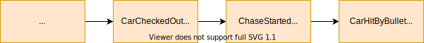
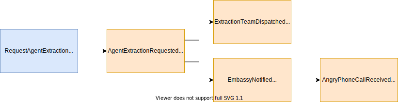

# Attributes of Commands and Events

A lot of this comes from [@SKleanthous](https://threader.app/thread/1197272391304523776).

## Message

A message is either a Command or an Event. Both share a lot of attributes.

## Data attribute

The event can have a payload describing parameters for the event. For example, a `ProductAddedToCartEvent` can have a payload of `{"productId":"...", "cartId":"...", "quantity":5}` .

TK is it possible for an event to have no payload \(the event is described only by its name\)?

This attribute is often called `payload` or `data`.

## Metadata attributes

TK add small discussion about whether or not an attribute should be required

### Aggregate id

The identifier of the aggregate this message is about.

### Name

Identifies the type of event, for example `WorkoutStarted`.


See also [Naming](naming.md#naming-your-events)


### Id

An identifier for the event. This can be used to deduplicate messages. Two messages are equal if their names and ids are equal.

### Aggregate version

Used for ordering. For commands, used for optimistic concurrency control. There should only be one aggregate version for an aggregate id.

### Event version

If the event is versioned, this field can be used to discern different versions of it. Some practitioners recommend always adding a version, event when you think you won't need it, others will say that events with the same name should always be compatible with each other \(comparable to backwards compatibility with [ProtoBufs](https://developers.google.com/protocol-buffers/)\).

Not to be confused with the version of the aggregate.

### Timestamp

Ideally, this is when the event happened or when it was emitted. When it's not possible to register that, it may also be the timestamp of when it was received by the infrastructure \(such as the event bus\).

Standard timestamp caveat apply: prefer an unambiguous, easily parsed format, such as the number of milliseconds since the UNIX epoch or [ISO 8601](https://en.wikipedia.org/wiki/ISO_8601).

The timestamp should not be used to order events to apply them. It's not a reliable indicator of message ordering when working in distributed systems \(clock skew, relativity, ...\).

### Correlation and causation references

See also [here](https://blog.arkency.com/correlation-id-and-causation-id-in-evented-systems/).

The **correlation id** points to the command that got the ball rolling. The **causation id** points to the direct parent that caused this event.

### Name of service which owns the contract of the message

TK

### Authentication token

TK

### 

