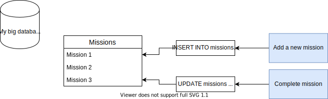

# Event Sourcing compared to Traditional Data and State Management

## Traditional State Management

Most data stores today are mutable. We can not only create data, but also update or delete it. This means that the data is mutable.

## Event Sourcing

Event Sourcing takes a different approach. Instead of updating the data in-place, an Event describing the change is saved. No data is updated or deleted. The state can then be created by applying all the events.

To find the current state for Mission 3, we would get all the events related to it, and then apply them in the order they occurred. This has a number of [advantages](../advantages-of-event-sourcing.md), two of which are immediately clear here: we have a full history for every mission, and we talk in meaningful terms about our domain \(`MissionObjectivesChanged` instead of `UPDATE missions SET objectives = ... WHERE ...`\).

